---
## Front matter
title: "Отчёт по лабораторной работе №4"
subtitle: "Создание и процесс обработки программ на языке ассемблера NASM"
author: "Юсупова Ксения Равилевна"

## Generic otions
lang: ru-RU
toc-title: "Содержание"

## Bibliography
bibliography: bib/cite.bib
csl: pandoc/csl/gost-r-7-0-5-2008-numeric.csl

## Pdf output format
toc: true # Table of contents
toc-depth: 2
lof: true # List of figures
lot: true # List of tables
fontsize: 12pt
linestretch: 1.5
papersize: a4
documentclass: scrreprt
## I18n polyglossia
polyglossia-lang:
  name: russian
  options:
	- spelling=modern
	- babelshorthands=true
polyglossia-otherlangs:
  name: english
## I18n babel
babel-lang: russian
babel-otherlangs: english
## Fonts
mainfont: IBM Plex Serif
romanfont: IBM Plex Serif
sansfont: IBM Plex Sans
monofont: IBM Plex Mono
mathfont: STIX Two Math
mainfontoptions: Ligatures=Common,Ligatures=TeX,Scale=0.94
romanfontoptions: Ligatures=Common,Ligatures=TeX,Scale=0.94
sansfontoptions: Ligatures=Common,Ligatures=TeX,Scale=MatchLowercase,Scale=0.94
monofontoptions: Scale=MatchLowercase,Scale=0.94,FakeStretch=0.9
mathfontoptions:
## Biblatex
biblatex: true
biblio-style: "gost-numeric"
biblatexoptions:
  - parentracker=true
  - backend=biber
  - hyperref=auto
  - language=auto
  - autolang=other*
  - citestyle=gost-numeric
## Pandoc-crossref LaTeX customization
figureTitle: "Рис."
tableTitle: "Таблица"
listingTitle: "Листинг"
lofTitle: "Список иллюстраций"
lotTitle: "Список таблиц"
lolTitle: "Листинги"
## Misc options
indent: true
header-includes:
  - \usepackage{indentfirst}
  - \usepackage{float} # keep figures where there are in the text
  - \floatplacement{figure}{H} # keep figures where there are in the text
---

# Цель работы

Освоение процедуры компиляции и сборки программ, написанных на ассемблере NASM.

# Задание

Написать программы, которые выведут "Hello world!" и имя с фамилией.

# Выполнение лабораторной работы

## Программа Hello world!

Создаем каталог для работы с программами на языке ассемблера NASM(рис. [-@fig:001]).

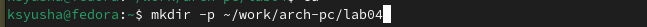{#fig:001 width=70%}

Переходим в  созданный каталог (рис. [-@fig:002]).

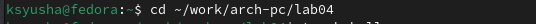{#fig:002 width=70%}

Создаем текстовый файл (рис. [-@fig:003]).

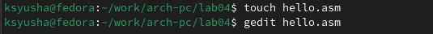{#fig:003 width=70%}

Открываем данный файл в текстовом редакторе (рис. [-@fig:004]).

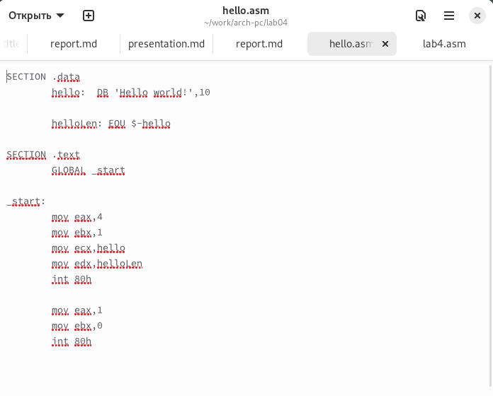{#fig:004 width=70%}

## Транслятор NASM

Для компиляции приведённого выше текста программы «Hello World» используем команду NASM (рис. [-@fig:005]).

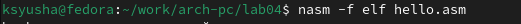{#fig:005 width=70%}

С помощью команды ls проверяем, что объектный файл был создан (рис. [-@fig:006]).

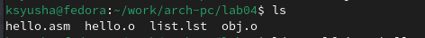{#fig:006 width=70%}

## Расширенный синтаксис командной строки NASM

Компилируем исходный файл hello.asm в obj.o и проверяем его создание с помощью ls(рис. [-@fig:007]).

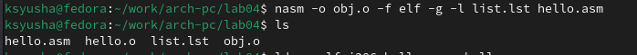{#fig:007 width=70%}

## Компоновщик LD

Передаем объектный файл на обработку компоновщику и проверяем создание файла hello с помощью ls (рис. [-@fig:008]).

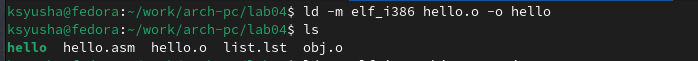{#fig:008 width=70%}

Передаем объектный файл на обработку компоновщику и проверяем создание файла hello с помощью ls (рис. [-@fig:009]).

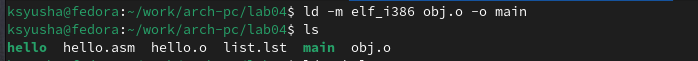{#fig:009 width=70%}

Смотрим формат командной строки LD, который можно увидеть, набрав ld --help.(рис. [-@fig:010]).

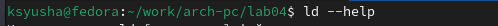{#fig:010 width=70%}

## Запуск исполняемого файла

Запускаем на выполнение созданный исполняемый файл (рис. [-@fig:011]).

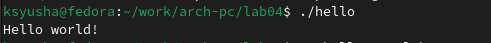{#fig:011 width=70%}

## Задание для самостоятельной работы

Создаем копию файла hello.asm с помощью команды cp (рис. [-@fig:012]).

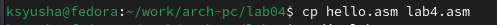{#fig:012 width=70%}

Открываем файл и редактируем его (рис. [-@fig:013]).

{#fig:013 width=70%}

Вносим изменения в текст программы в файле lab4.asm так, чтобы вместо Hello world! на экран выводилась строка с вашими фамилией и именем (рис. [-@fig:014]).

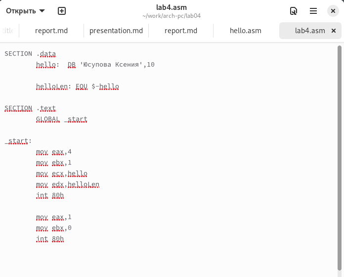{#fig:014 width=70%}

Прописываем команды для работы файла и запускаем программу (рис. [-@fig:015]).

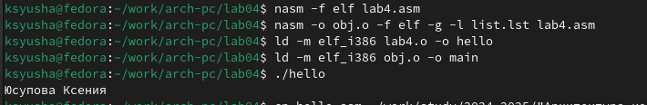{#fig:015 width=70%}

Копируем файлы в локальный репозиторий (рис. [-@fig:016]).

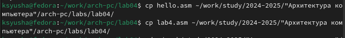{#fig:016 width=70%}

Прикрепляем файлы hello.asm lab4.asm (рис. [-@fig:017]).

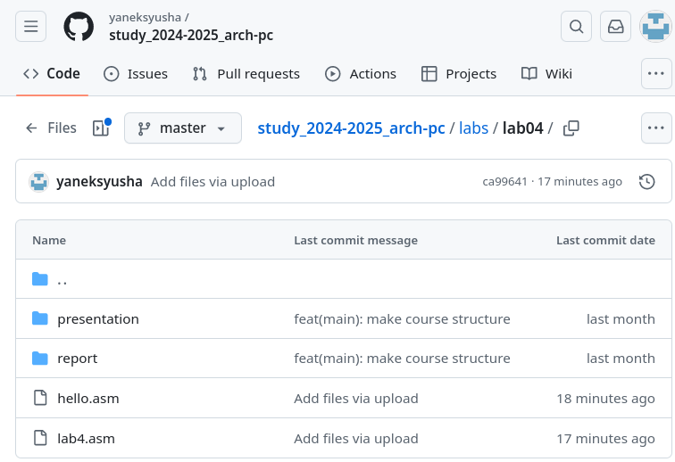{#fig:017 width=70%}

# Выводы

Мы освоили процедуры компиляции и сборки программ, написанных на ассемблере NASM.
