---
## Front matter
title: "Отчёт по лабораторной работе №5"
subtitle: "Основы работы с Midnight Commander (mc). Структура программы на языке ассемблера NASM. Системные вызовы в ОС
GNU Linux"
author: "Юсупова Ксения Равилевна"

## Generic otions
lang: ru-RU
toc-title: "Содержание"

## Bibliography
bibliography: bib/cite.bib
csl: pandoc/csl/gost-r-7-0-5-2008-numeric.csl

## Pdf output format
toc: true # Table of contents
toc-depth: 2
lof: true # List of figures
lot: true # List of tables
fontsize: 12pt
linestretch: 1.5
papersize: a4
documentclass: scrreprt
## I18n polyglossia
polyglossia-lang:
  name: russian
  options:
	- spelling=modern
	- babelshorthands=true
polyglossia-otherlangs:
  name: english
## I18n babel
babel-lang: russian
babel-otherlangs: english
## Fonts
mainfont: IBM Plex Serif
romanfont: IBM Plex Serif
sansfont: IBM Plex Sans
monofont: IBM Plex Mono
mathfont: STIX Two Math
mainfontoptions: Ligatures=Common,Ligatures=TeX,Scale=0.94
romanfontoptions: Ligatures=Common,Ligatures=TeX,Scale=0.94
sansfontoptions: Ligatures=Common,Ligatures=TeX,Scale=MatchLowercase,Scale=0.94
monofontoptions: Scale=MatchLowercase,Scale=0.94,FakeStretch=0.9
mathfontoptions:
## Biblatex
biblatex: true
biblio-style: "gost-numeric"
biblatexoptions:
  - parentracker=true
  - backend=biber
  - hyperref=auto
  - language=auto
  - autolang=other*
  - citestyle=gost-numeric
## Pandoc-crossref LaTeX customization
figureTitle: "Рис."
tableTitle: "Таблица"
listingTitle: "Листинг"
lofTitle: "Список иллюстраций"
lotTitle: "Список таблиц"
lolTitle: "Листинги"
## Misc options
indent: true
header-includes:
  - \usepackage{indentfirst}
  - \usepackage{float} # keep figures where there are in the text
  - \floatplacement{figure}{H} # keep figures where there are in the text
---

# Цель работы

Приобрести практические навыки работы в Midnight Commander и освоить инструкции
языка ассемблера mov и int.

# Выполнение лабораторной работы

## Порядок выполнения лабораторной работы

Открываем Midnight Commander (рис. [-@fig:001]).

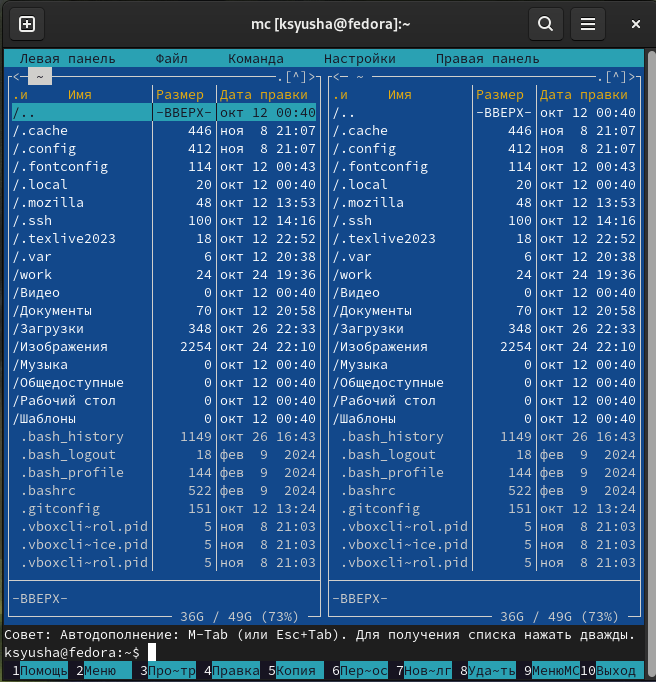{#fig:001 width=70%}

Пользуясь клавишами ↑ , ↓ и Enter переходим в каталог ~/work/arch-pc созданный
при выполнении лабораторной работы №4  (рис. [-@fig:002]).

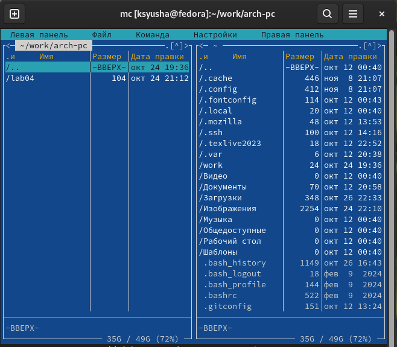{#fig:002 width=70%}

С помощью функциональной клавиши F7 создём папку lab05 и переходим
в созданный каталог (рис. [-@fig:003]).

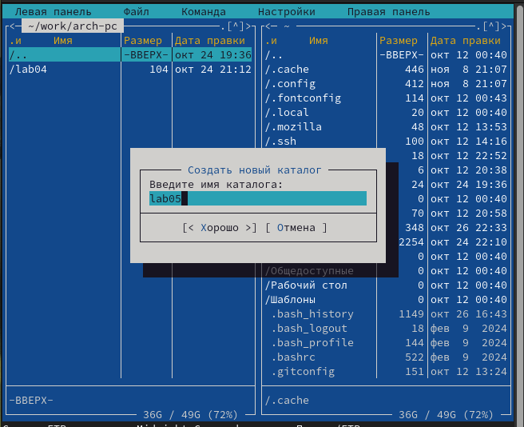{#fig:003 width=70%}

Пользуясь строкой ввода и командой touch создаём файл lab5-1.asm  (рис. [-@fig:004]).

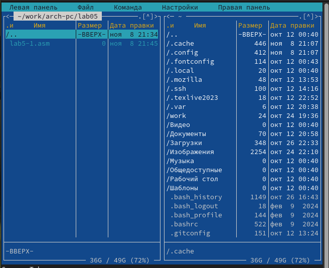{#fig:004 width=70%}

С помощью функциональной клавиши F4 откроем файл lab5-1.asm для редактирова-
ния во встроенном редакторе, в качестве встроенного редактора Midnight
Commander используем редактор mcedit. Редактируем файл, вводя программы ((рис. [-@fig:005]).

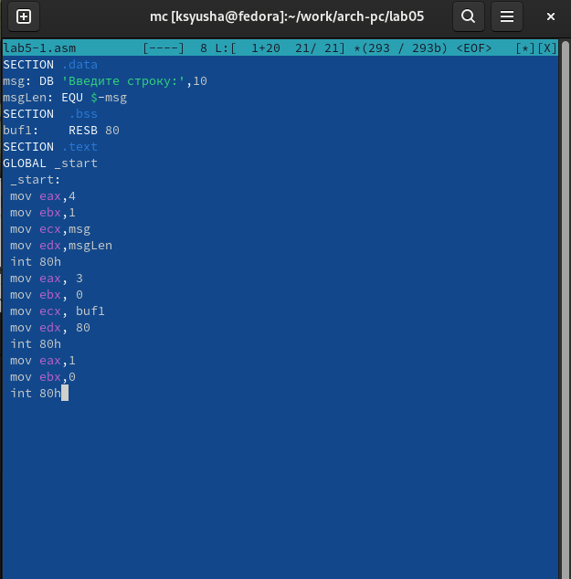{#fig:005 width=70%}

Открываем файл lab5-1.asm функциональной клавишей F3 для перепроверки(рис. [-@fig:006]).

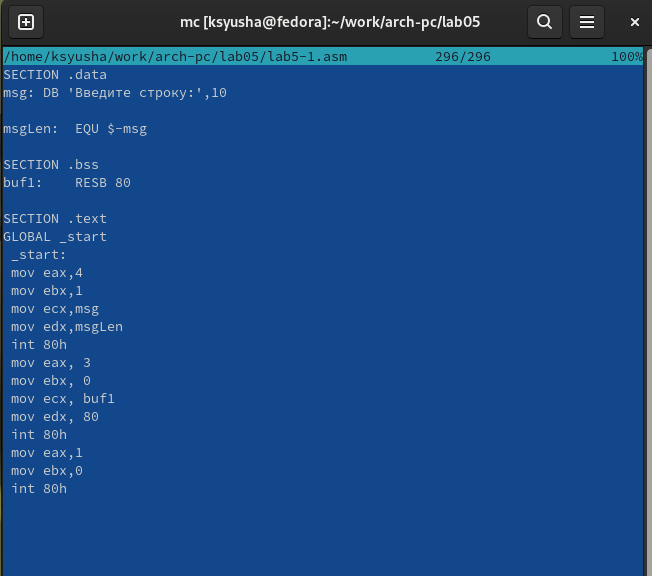{#fig:006 width=70%}

Оттранслируем текст программы lab5-1.asm в объектный файл. Выполняем компоновку объектного файла и запускаем получившийся исполняемый файл. Программа выводит строку 'Введите строку:' и ожидает ввода с клавиатуры. На запрос вводим ФИО(рис. [-@fig:007]).

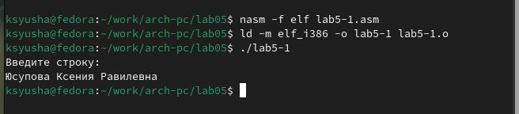{#fig:007 width=70%}

Скачиваем файл со страницы курса (рис. [-@fig:008]).

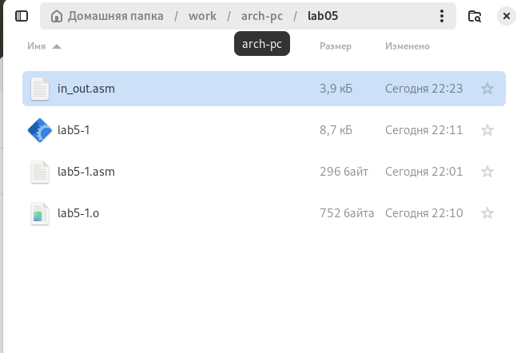{#fig:008 width=70%}

Копируем файл в каталог с программой (рис. [-@fig:009]).

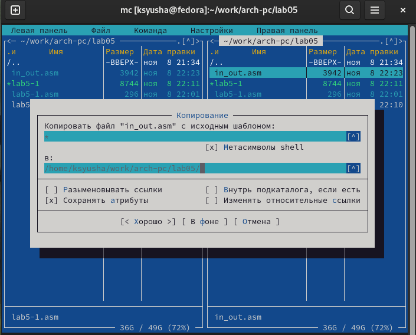{#fig:009 width=70%}

С помощью функциональной клавиши F6 создаём копию файла lab5-1.asm с именем
lab5-2.asm. Выделяем файл lab5-1.asm, нажимаем клавишу F6 , вводим имя файла
lab5-2.asm и нажимаем клавишу Enter .(рис. [-@fig:010]).

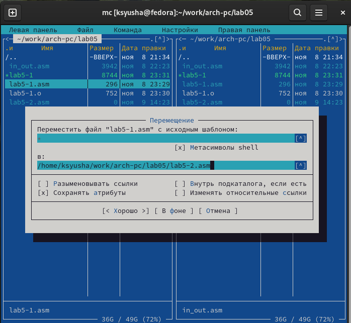{#fig:010 width=70%}

Исправляем текст программы в файле lab5-2.asm с использованием подпрограмм из
внешнего файла in_out.asm(рис. [-@fig:011]).

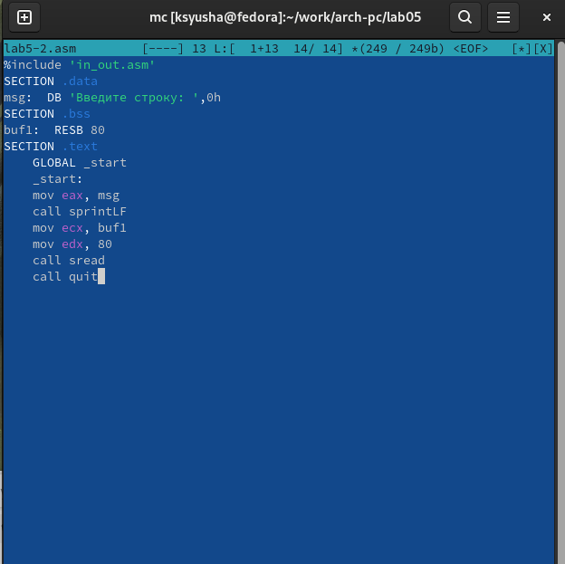{#fig:011 width=70%}

Запускаем программу и проверяем её на работу(рис. [-@fig:012]).

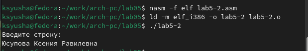{#fig:012 width=70%}

 В файле lab5-2.asm заменяем подпрограмму sprintLF на sprint. Создаём исполняемый файл и проверяем его работу.(рис. [-@fig:013]).

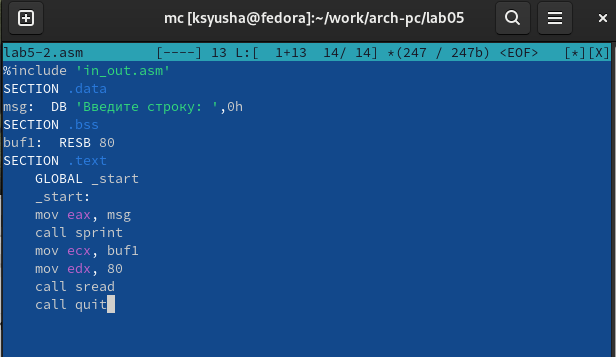{#fig:013 width=70%}

Запускаем программу и проверяем её на работу(рис. [-@fig:014]).

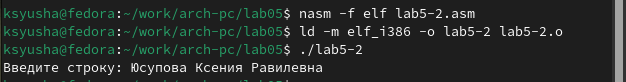{#fig:014 width=70%}

После полученных программ, можем сделать вывод, что программа sprintLF переносит текст на следущую строку, а команда sprint оставляет текст на той же строке.

## Задания для самостоятельной работы

Создаем копию файла lab5-1.asm и называем его lab5-3.asm(рис. [-@fig:015]).

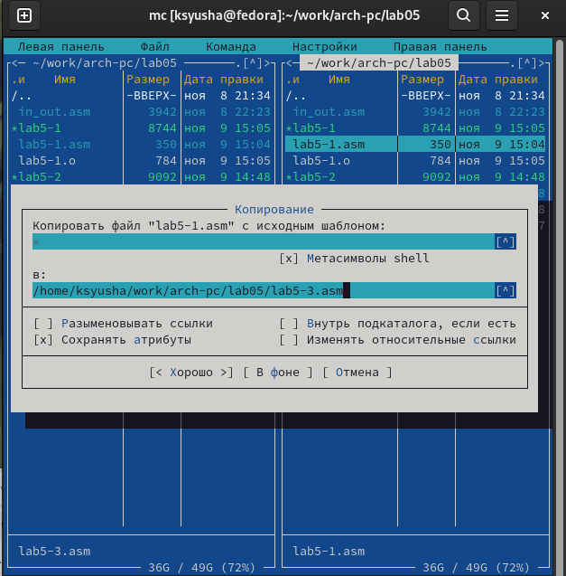{#fig:015 width=70%}

Внесим изменения в программу (без использования внешнего файла in_out.asm), так чтобы она работала по алгоритму:
• вывести приглашение типа “Введите строку:”;
• ввести строку с клавиатуры;
• вывести введённую строку на экран. (рис. [-@fig:016]).

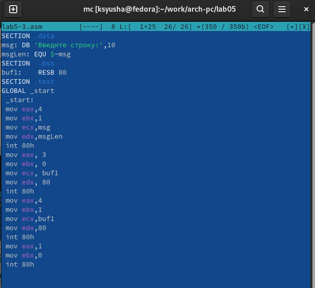{#fig:016 width=70%}

Запускаем программу и проверяем её работу(рис. [-@fig:017]).

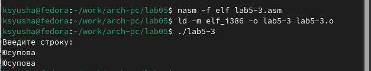{#fig:017 width=70%}

Создаем копию файла lab5-2.asm и называем его lab5-4.asm(рис. [-@fig:018]).

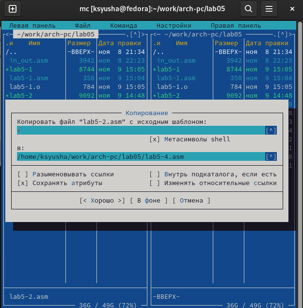{#fig:018 width=70%}

Исправьляем текст программы с использованием программ из внешнего файла in_out.asm, так чтобы она работала по следующему алгоритму:
• вывести приглашение типа “Введите строку:”;
• ввести строку с клавиатуры;
• вывести введённую строку на экран.(рис. [-@fig:019]).

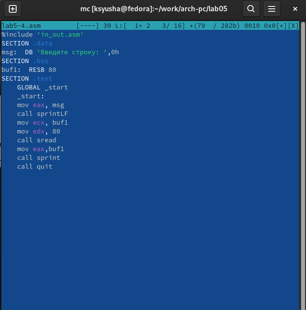{#fig:019 width=70%}

Запускаем программу и проверяем её работу (рис. [-@fig:020]).

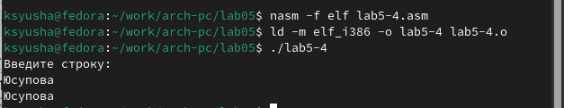{#fig:020 width=70%}

# Выводы

В ходе лабораторной работы, мы приобрели практические навыки работы в Midnight Commander и освоили инструкции языка ассемблера mov и int.

