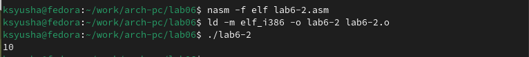
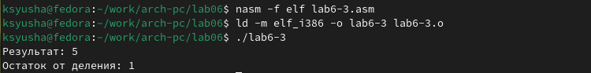

---
## Front matter
title: "Отчёт по лабораторной работе №6"
subtitle: "Арифметические операции в NASM"
author: "Юсупова Ксения Равилевна"

## Generic otions
lang: ru-RU
toc-title: "Содержание"

## Bibliography
bibliography: bib/cite.bib
csl: pandoc/csl/gost-r-7-0-5-2008-numeric.csl

## Pdf output format
toc: true # Table of contents
toc-depth: 2
lof: true # List of figures
lot: true # List of tables
fontsize: 12pt
linestretch: 1.5
papersize: a4
documentclass: scrreprt
## I18n polyglossia
polyglossia-lang:
  name: russian
  options:
	- spelling=modern
	- babelshorthands=true
polyglossia-otherlangs:
  name: english
## I18n babel
babel-lang: russian
babel-otherlangs: english
## Fonts
mainfont: IBM Plex Serif
romanfont: IBM Plex Serif
sansfont: IBM Plex Sans
monofont: IBM Plex Mono
mathfont: STIX Two Math
mainfontoptions: Ligatures=Common,Ligatures=TeX,Scale=0.94
romanfontoptions: Ligatures=Common,Ligatures=TeX,Scale=0.94
sansfontoptions: Ligatures=Common,Ligatures=TeX,Scale=MatchLowercase,Scale=0.94
monofontoptions: Scale=MatchLowercase,Scale=0.94,FakeStretch=0.9
mathfontoptions:
## Biblatex
biblatex: true
biblio-style: "gost-numeric"
biblatexoptions:
  - parentracker=true
  - backend=biber
  - hyperref=auto
  - language=auto
  - autolang=other*
  - citestyle=gost-numeric
## Pandoc-crossref LaTeX customization
figureTitle: "Рис."
tableTitle: "Таблица"
listingTitle: "Листинг"
lofTitle: "Список иллюстраций"
lotTitle: "Список таблиц"
lolTitle: "Листинги"
## Misc options
indent: true
header-includes:
  - \usepackage{indentfirst}
  - \usepackage{float} # keep figures where there are in the text
  - \floatplacement{figure}{H} # keep figures where there are in the text
---

# Цель работы

Освоить арифметические инструкции языка ассемблера NASM

# Выполнение лабораторной работы

## Символьные и численные данные в NASM

Создаём каталог для программам лабораторной работы № 6, переходим в него и
создаём файл lab6-1.asm(рис. [-@fig:001]).

{#fig:001 width=70%}

Вводим в файл lab6-1.asm текст программы из листинга 6.1. В данной программе в регистр eax записывается символ 6 (mov eax,'6'), в регистр ebx символ 4 (mov ebx,'4'). (рис. [-@fig:002]).

{#fig:002 width=70%}

Создаем исполняемый файл и запускаем его(рис. [-@fig:003]).

{#fig:003 width=70%}

Далее изменяем текст программы и вместо символов, записываем в регистры числа.(рис. [-@fig:004]).

{#fig:004 width=70%}

Создаем исполняемый файл и запускаем его((рис. [-@fig:005]).

{#fig:005 width=70%}

Создаём файл lab6-2.asm в каталоге ~/work/arch-pc/lab06(рис. [-@fig:006]).

{#fig:006 width=70%}

Вводим в файл текст программы из листинга(рис. [-@fig:007]).

{#fig:007 width=70%}

Создаем исполняемый файл и запускаем его(рис. [-@fig:008]).

{#fig:008 width=70%}

Далее также как и ранее изменяем текст программы и вместо символов, записываем числа(рис. [-@fig:009]).

{#fig:009 width=70%}

Создаем исполняемый файл и запускаем его(рис. [-@fig:010]).

{#fig:010 width=70%}

Открываем файл для редактирования и изменяем функцию iprintLF на iprint. (рис. [-@fig:011]).

{#fig:011 width=70%}

Создаем исполняемый файл и запускаем его(рис. [-@fig:012]).

{#fig:012 width=70%}

Таким образом, можем сделать вывод, что при использовании функции iprintLF переносит вывод на отдельную новую строку, а при использовании iprint этого не происходит.

## Выполнение арифметических операций в NASM

Создаём файл lab6-3.asm в каталоге ~/work/arch-pc/lab06(рис. [-@fig:013]).

{#fig:013 width=70%}

Внимательно изучаем текст программы из листинга 6.3, в котором говорится как выполненяется арифметическая операция в NASM для вычисления арифметического выражения f(x) = (5 * 2 + 3)/3.Вводим листинг в файл lab6-3.asm.(рис. [-@fig:014]).

{#fig:014 width=70%}

Создаем исполняемый файл и запускаем его(рис. [-@fig:015]).

{#fig:015 width=70%}

Изменяем текст программы для вычисления выражения f(x) = (4 * 6 + 2)/5.(рис. [-@fig:016]).

{#fig:016 width=70%}

Создаем исполняемый файл и запускаем его(рис. [-@fig:017]).

{#fig:017 width=70%}

Создаём файл variant.asm в каталоге ~/work/arch-pc/lab06(рис. [-@fig:018]).

{#fig:018 width=70%}

Внимательно изучаем текст программы из листинга 6.4 и вводим в файл variant.asm.(рис. [-@fig:019]).

{#fig:019 width=70%}

Создаем исполняемый файл и запускаем его(рис. [-@fig:020]).

{#fig:020 width=70%}

## Ответы на вопросы
1. За вывод на экран сообщения ‘Ваш вариант:’ в листинге 6.4 отвечают строки:

mov eax,rem

call sprint

2. Эти инструкции используются для считывания строки с предполагаемым вводом значений.

mov ecx, x - адрес строки сохраняется в регистре ecx

mov edx, 80 - задаётся максимальное количество символов для считывания строки, и сохранятся в edx

call sread - инструкция для чтения строки

3. Инструкция atoi используетя для корректной работы арифметических операций в NASM, так как символы необходимо преобразовать в числа, а ввод с клавиатуры осуществляется в символьном виде.

4. За вычисление варианта в листинге 6.4 отвечают строки:

xor edx,edx

mov ebx,20

div ebx

inc edx

5. Остаток от деления при выполнении инструкции “div ebx” записывается в регистр edx.

6. Инструкция “inc edx” используется для увеличения на 1 регистра edx

7. За вывод на экран результата вычислений листинга 6.4 отвечают строки:

mov eax,edx

call iprintLF

## Задания для самостоятельной работы

Создаем файл lab6-4.asm в каталоге ~/work/arch-pc/lab06(рис. [-@fig:021]).

{#fig:021 width=70%}

Пишем программу вычисления выражения y = f(x). Программа должна выводить
выражение для вычисления функции f(x)=(8*x-6)/2 , выводить запрос на ввод значения x, вычислять заданное выражение в зависимости от введенного x, выводить результат вычислений.(рис. [-@fig:022]).

{#fig:022 width=70%}

Создаем исполняемый файл и запускаем его(рис. [-@fig:023]).

{#fig:023 width=70%}

# Выводы

В ходе лабораторной работы мы освоили арифметические инструкции языка ассемблера NASM.

