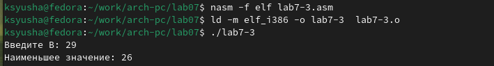

---
## Front matter
title: "Отчёт по лабораторной работе №7"
subtitle: "Команды безусловного и условного переходов в Nasm. Программирование ветвлений."
author: "Юсупова Ксения Равилевна"

## Generic otions
lang: ru-RU
toc-title: "Содержание"

## Bibliography
bibliography: bib/cite.bib
csl: pandoc/csl/gost-r-7-0-5-2008-numeric.csl

## Pdf output format
toc: true # Table of contents
toc-depth: 2
lof: true # List of figures
lot: true # List of tables
fontsize: 12pt
linestretch: 1.5
papersize: a4
documentclass: scrreprt
## I18n polyglossia
polyglossia-lang:
  name: russian
  options:
	- spelling=modern
	- babelshorthands=true
polyglossia-otherlangs:
  name: english
## I18n babel
babel-lang: russian
babel-otherlangs: english
## Fonts
mainfont: IBM Plex Serif
romanfont: IBM Plex Serif
sansfont: IBM Plex Sans
monofont: IBM Plex Mono
mathfont: STIX Two Math
mainfontoptions: Ligatures=Common,Ligatures=TeX,Scale=0.94
romanfontoptions: Ligatures=Common,Ligatures=TeX,Scale=0.94
sansfontoptions: Ligatures=Common,Ligatures=TeX,Scale=MatchLowercase,Scale=0.94
monofontoptions: Scale=MatchLowercase,Scale=0.94,FakeStretch=0.9
mathfontoptions:
## Biblatex
biblatex: true
biblio-style: "gost-numeric"
biblatexoptions:
  - parentracker=true
  - backend=biber
  - hyperref=auto
  - language=auto
  - autolang=other*
  - citestyle=gost-numeric
## Pandoc-crossref LaTeX customization
figureTitle: "Рис."
tableTitle: "Таблица"
listingTitle: "Листинг"
lofTitle: "Список иллюстраций"
lotTitle: "Список таблиц"
lolTitle: "Листинги"
## Misc options
indent: true
header-includes:
  - \usepackage{indentfirst}
  - \usepackage{float} # keep figures where there are in the text
  - \floatplacement{figure}{H} # keep figures where there are in the text
---

# Цель работы

Изучение команд условного и безусловного переходов. Приобретение навыков написания программ с использованием переходов. Знакомство с назначением и структурой файла листинга.

# Задание

Написать программы для решения системы выражений.

# Выполнение лабораторной работы

## Реализация переходов в NASM

Создаем каталог для программам лабораторной работы № 7, переходим в него и со-
здаём файл lab7-1.asm(рис. [-@fig:001]).

{#fig:001 width=70%}

Вводим в файл lab7-1.asm текст программы из листинга 7.1. В данной программе рассмотрим пример программы с использованием инструкции jmp. (рис. [-@fig:002]).

{#fig:002 width=70%}

Создаем исполняемый файл и запускаем его(рис. [-@fig:003]).

{#fig:003 width=70%}

Далее изменяем текст программы в соответствии с листингом 7.2.(рис. [-@fig:004]).

{#fig:004 width=70%}

Создаем исполняемый файл и запускаем его((рис. [-@fig:005]).

{#fig:005 width=70%}

Снова открываем файл для редактирования и изменяем его, чтобы произошел
необходимый вывод(рис. [-@fig:006]).

{#fig:006 width=70%}

Создаем исполняемый файл и запускаем его(рис. [-@fig:007]).

{#fig:007 width=70%}

Создаем исполняемый новый файл lab7-2.asm в каталоге ~/work/arch-pc/lab07.с помощью команды touch(рис. [-@fig:008]).

{#fig:008 width=70%}

Вводим в файл lab7-2.asm текст программы из листинга 7.3.(рис. [-@fig:009], [-@fig:010]).

{#fig:009 width=70%}

{#fig:010 width=70%}

Создаем исполняемый файл и проверяем его работу, вводя разные значения B (рис. [-@fig:011]).

{#fig:011 width=70%}

## Изучение структуры файлы листинга

Создаем файл листинга дла программы из файла lab7-2.asm(рис. [-@fig:012]).

{#fig:012 width=70%}

Открываем файл листинга с помощью команды mcedit и изучаем его(рис. [-@fig:013]).

{#fig:013 width=70%}

Внимательно ознакомились с форматом и содержимым файла. Подробно объяем содержимое трёх строк файла листинга по выбору:

Строка 65: 00000045- адрес в сегменте кода, ВВ00000000-машинный код, mov ebx,1 - исходный текст программы, присвоение переменной ebx значения 1.

Строка 66: 0000004А- адрес в сегменте кода, В803000000-машинный код, mov eаx,3 - исходный текст программы, присвоение переменной eаx значения 3.

Строка 67: 0000004F- адрес в сегменте кода, CD80-машинный код, int 80h - исходный текст программы, вызов ядра. (рис. [-@fig:014]).

{#fig:014 width=70%}

Открываем файл и удаляем один операндум(рис. [-@fig:015]).

{#fig:015 width=70%}

Выполняем трансляцию с получением файла листинга и замечаем, что при трансляции файла появляется ошибка(рис. [-@fig:016]).

{#fig:016 width=70%}

В новом файле листинга также появилась ошибка, которая возникла при попытке трансляции файла. Выходные файлы, кроме файла листинга, не создаются(рис. [-@fig:017]).

{#fig:017 width=70%}

## Задание для самостоятельной работы

Вариант 12

1. Напишите программу нахождения наименьшей из 3 целочисленных переменных a, b и c. (Значения переменных выбраны из табл. 7.5 в соответствии с 12 вариантом)

Создаем новый файл lab7-3.asm для выполнения 1 задания(рис. [-@fig:018]).

{#fig:018 width=70%}

Открываем файл и пишем программу, которая выберет наименьшее число из
трех.(рис. [-@fig:019], [-@fig:020]).

{#fig:019 width=70%}

{#fig:020 width=70%}

Создаем исполняемый файл и запускаем его(рис. [-@fig:021]).

{#fig:021 width=70%}

2. Напишите программу, которая для введенных с клавиатуры значений х и а вычисляет значение заданной функции f(x) и выводит результат вычислений. (Вид функции f(x) был выбран в соответствии с 12 вариантом)

Создаем новый файл lab7-4.asm для выполнения 2 задания(рис. [-@fig:022]).

{#fig:022 width=70%}

Открываем файл и пишем программу, которая вычислит значение функции, в зависмоти от введённых данных(рис. [-@fig:023], [-@fig:024]).

{#fig:023 width=70%}

{#fig:024 width=70%}

Создаем исполняемый файл и запускаем его (рис. [-@fig:025])

{#fig:025 width=70%}

# Выводы

В ходе лабораторной работы, мы изучили команды условного и безусловного переходов, приобрели навыки написания программ с использованием переходов,и понакомились с назначением и структурой файла листинга.

