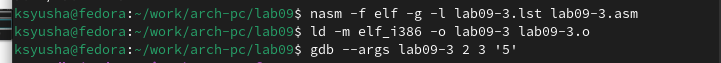

---
## Front matter
title: "Отчёт по лабораторной работе №9"
subtitle: "Понятие подпрограммы. Отладчик GDB."
author: "Юсупова Ксения Равилевна"

## Generic otions
lang: ru-RU
toc-title: "Содержание"

## Bibliography
bibliography: bib/cite.bib
csl: pandoc/csl/gost-r-7-0-5-2008-numeric.csl

## Pdf output format
toc: true # Table of contents
toc-depth: 2
lof: true # List of figures
lot: true # List of tables
fontsize: 12pt
linestretch: 1.5
papersize: a4
documentclass: scrreprt
## I18n polyglossia
polyglossia-lang:
  name: russian
  options:
	- spelling=modern
	- babelshorthands=true
polyglossia-otherlangs:
  name: english
## I18n babel
babel-lang: russian
babel-otherlangs: english
## Fonts
mainfont: IBM Plex Serif
romanfont: IBM Plex Serif
sansfont: IBM Plex Sans
monofont: IBM Plex Mono
mathfont: STIX Two Math
mainfontoptions: Ligatures=Common,Ligatures=TeX,Scale=0.94
romanfontoptions: Ligatures=Common,Ligatures=TeX,Scale=0.94
sansfontoptions: Ligatures=Common,Ligatures=TeX,Scale=MatchLowercase,Scale=0.94
monofontoptions: Scale=MatchLowercase,Scale=0.94,FakeStretch=0.9
mathfontoptions:
## Biblatex
biblatex: true
biblio-style: "gost-numeric"
biblatexoptions:
  - parentracker=true
  - backend=biber
  - hyperref=auto
  - language=auto
  - autolang=other*
  - citestyle=gost-numeric
## Pandoc-crossref LaTeX customization
figureTitle: "Рис."
tableTitle: "Таблица"
listingTitle: "Листинг"
lofTitle: "Список иллюстраций"
lotTitle: "Список таблиц"
lolTitle: "Листинги"
## Misc options
indent: true
header-includes:
  - \usepackage{indentfirst}
  - \usepackage{float} # keep figures where there are in the text
  - \floatplacement{figure}{H} # keep figures where there are in the text
---

# Цель работы

Приобретение навыков написания программ с использованием подпрограмм. Знакомство с методами отладки при помощи GDB и его основными возможностями.

# Выполнение лабораторной работы

## Реализация подпрограмм в NASM

Создаем каталог для программам лабораторной работы № 9, переходим в него и со-
здаём файл lab9-1.asm(рис. [-@fig:001]).

{#fig:001 width=70%}

Вводим в файл lab7-1.asm текст программы из листинга 9.1. (рис. [-@fig:002]).

{#fig:002 width=70%}

Создаем исполняемый файл и запускаем его(рис. [-@fig:003]).

{#fig:003 width=70%}

Далее изменяем текст программы, добавив подпрограмму _subcalcul в подпрограмму _calcul.(рис. [-@fig:004]).

{#fig:004 width=70%}

Создаем исполняемый файл и запускаем его((рис. [-@fig:005]).

{#fig:005 width=70%}

## Отладка программам с помощью GDB

Создаем исполняемый новый файл lab09-2.asm в каталоге ~/work/arch-pc/lab09.с помощью команды touch(рис. [-@fig:006]).

{#fig:006 width=70%}

Открываем файл в Midnight Commander и заполняем его в соответствии с
листингом(рис. [-@fig:007]).

{#fig:007 width=70%}

Получаем исходный файл с использованием отладчика gdb(рис. [-@fig:008]).

{#fig:008 width=70%}

Проверяем работу программы, запустив ее в оболочке GDB с помощью команды run.(рис. [-@fig:009])

{#fig:009 width=70%}

Для более подробного анализа программы установим брейкпоинт на метку _start, с
которой начинается выполнение любой ассемблерной программы, и запустим её(рис. [-@fig:010]).

{#fig:010 width=70%}

Посмотрим дисассимилированный код программы с помощью команды disassemble начиная с метки _start (рис. [-@fig:011]).

{#fig:011 width=70%}

Переключаемся на отображение команд с Intel’овским синтаксисом, введя команду set disassembly-flavor intel(рис. [-@fig:012]).

{#fig:012 width=70%}

Главное различие между ATT и Intel синтаксисом ассемблера — порядок операндов: ATT использует источник, назначение, а Intel — назначение, источник. ATT использует префикс % для регистров (например, %eax), а Intel — нет (например, eax). Формат мемориальных адресов также немного отличается. Многие ассемблеры поддерживают оба синтаксиса.

Включим режим псевдографики для более удобного анализа программы(рис. [-@fig:013]).

{#fig:013 width=70%}

На предыдущих шагах была установлена точка останова по имени метки (_start). Проверим это с помощью команды info breakpoints. Установим еще одну точку останова по адресу инструкции.(рис. [-@fig:014]).

{#fig:014 width=70%}

Посмотрим информацию о всех установленных точках останова(рис. [-@fig:015]).

{#fig:015 width=70%}

Выполняем 5 инструкций командой si(рис. [-@fig:016]).

{#fig:016 width=70%}

Во время выполнения команд менялись регистры: ebx, ecx, edx,eax, eip.

Смотрим значение переменной msg1 по имени(рис. [-@fig:017]).

{#fig:017 width=70%}

Смотрим значение переменной msg2 по адресу(рис. [-@fig:018]).

{#fig:018 width=70%}

Изменим первый символ переменной msg1.(рис. [-@fig:019])

{#fig:019 width=70%}

Изменим первый символ переменной msg2(рис. [-@fig:020]).

{#fig:020 width=70%}

Смотрим значение регистра edx в разных форматах(рис. [-@fig:021]).

{#fig:021 width=70%}

Изменяем регистор ebx(рис. [-@fig:022]).

{#fig:022 width=70%}

Вывод команд p/s $ebx имеет разные значения, так как команда без кавычек присваивает регистру вводимое значение.

Завершаем выполнение программы с помощью команды continue (сокращенно c) и выходим из GDB с помощью команды quit (сокращенно q).(рис. [-@fig:023])

{#fig:023 width=70%}

Скопируем файл lab8-2.asm, созданный при выполнении лабораторной работы №8, с программой выводящей на экран аргументы командной строки (Листинг 8.2) в файл с именем lab09-3.asm.(рис. [-@fig:024]).

{#fig:024 width=70%}

Создаем исполняемый файл и запускаем его в отладчике GDB (рис. [-@fig:025])

{#fig:025 width=70%}

Для начала установим точку останова перед первой инструкцией в программе и запустим ее.(рис. [-@fig:026]).

{#fig:026 width=70%}

Смотрим позиции стека по разным адресам. (рис. [-@fig:027]).

{#fig:027 width=70%}

Шаг изменения адреса равен 4, потому что адресные регистры имеют размер-
ность 32 бита или же 4 байта.

## Задание для самостоятельной работы

### Задание 1

1. Преобразуйте программу из лабораторной работы №8 (Задание №1 для самостоятельной работы), реализовав вычисление значения функции f(x) как подпрограмму.

Создаем исполняемый новый файл lab09-4.asm в каталоге ~/work/arch-pc/lab09.с помощью команды touch и скопировали в него файл lab8-4.asm(рис. [-@fig:028]).

{#fig:028 width=70%}

Открываем файл в Midnight Commander и меняем его, создавая подпрограмму(рис. [-@fig:029]).

{#fig:029 width=70%}

Создаем исполняемый файл и запускаем его((рис. [-@fig:030]).

{#fig:030 width=70%}

### Задание 2

2. В листинге 9.3 приведена программа вычисления выражения (3 + 2) ∗ 4 + 5. При запуске данная программа дает неверный результат. Проверьте это. С помощью отладчика GDB, анализируя изменения значений регистров, определите ошибку и исправьте ее.

Создаём файл lab09-4.asm и заполняем его в соответствии с листингом 9.3 (рис. [-@fig:031]).

{#fig:031 width=70%}

Создаем исполняемый файл и запускаем его, проверяя вывод ошибочного значения(рис. [-@fig:032]).

{#fig:032 width=70%}

Загружаем исходный файл в отладчик(рис. [-@fig:033]).

{#fig:033 width=70%}

Запускаем файл в отладчике GDB и смотрим на изменение регистров командой si(рис. [-@fig:034])

{#fig:034 width=70%}

Изменяем программу так, чтобы вывод был верным [-@fig:035]).

{#fig:035 width=70%}

Создаем исполняемый файл и проверяем корректность работы(рис. [-@fig:036]).

{#fig:036 width=70%}

# Выводы

В ходе лабораторной работы мы приобретели навыки написания программ с использованием подпрограмм, и ознакомились с методами отладки при помощи GDB и его основными возможностями.

# Список литературы{.unnumbered}

::: {#refs}
:::
