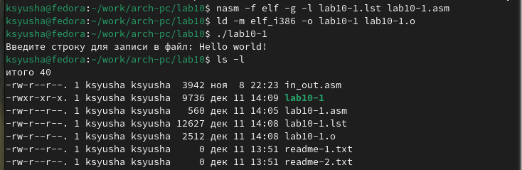

---
## Front matter
title: "Отчёт по лабораторной работе №10"
subtitle: "Работа с файлами средствами Nasm"
author: "Юсупова Ксения Равилевна"

## Generic otions
lang: ru-RU
toc-title: "Содержание"

## Bibliography
bibliography: bib/cite.bib
csl: pandoc/csl/gost-r-7-0-5-2008-numeric.csl

## Pdf output format
toc: true # Table of contents
toc-depth: 2
lof: true # List of figures
lot: true # List of tables
fontsize: 12pt
linestretch: 1.5
papersize: a4
documentclass: scrreprt
## I18n polyglossia
polyglossia-lang:
  name: russian
  options:
	- spelling=modern
	- babelshorthands=true
polyglossia-otherlangs:
  name: english
## I18n babel
babel-lang: russian
babel-otherlangs: english
## Fonts
mainfont: IBM Plex Serif
romanfont: IBM Plex Serif
sansfont: IBM Plex Sans
monofont: IBM Plex Mono
mathfont: STIX Two Math
mainfontoptions: Ligatures=Common,Ligatures=TeX,Scale=0.94
romanfontoptions: Ligatures=Common,Ligatures=TeX,Scale=0.94
sansfontoptions: Ligatures=Common,Ligatures=TeX,Scale=MatchLowercase,Scale=0.94
monofontoptions: Scale=MatchLowercase,Scale=0.94,FakeStretch=0.9
mathfontoptions:
## Biblatex
biblatex: true
biblio-style: "gost-numeric"
biblatexoptions:
  - parentracker=true
  - backend=biber
  - hyperref=auto
  - language=auto
  - autolang=other*
  - citestyle=gost-numeric
## Pandoc-crossref LaTeX customization
figureTitle: "Рис."
tableTitle: "Таблица"
listingTitle: "Листинг"
lofTitle: "Список иллюстраций"
lotTitle: "Список таблиц"
lolTitle: "Листинги"
## Misc options
indent: true
header-includes:
  - \usepackage{indentfirst}
  - \usepackage{float} # keep figures where there are in the text
  - \floatplacement{figure}{H} # keep figures where there are in the text
---

# Цель работы

Приобретение навыков написания программ для работы с файлами.

# Выполнение лабораторной работы

Создаем каталог для программам лабораторной работы № 10, переходим в него и со-
здаём файл lab10-1.asm(рис. [-@fig:001]).

{#fig:001 width=70%}

Вводим в файл lab10-1.asm текст программы из листинга 10.1. (рис. [-@fig:002]).

{#fig:002 width=70%}

Создаем исполняемый файл и запускаем его(рис. [-@fig:003]).

{#fig:003 width=70%}

С помощью команды chmod изменяем права доступа к исполняемому файлу lab10-1,
запретив его выполнение.(рис. [-@fig:004]).

{#fig:004 width=70%}

В результате использования команды chmod для запрета исполнения файла было отказано в доступе, так как этой командой мы изменили права владельца и больше не можем исполнять файл.

Снова с помощью команды chmod изменяем права доступа к файлу lab10-1.asm с исходным текстом программы, добавив права на исполнение.(рис. [-@fig:005]).

{#fig:005 width=70%}

В результате использования команды chmod для разрешения исполнения файла мы не получаем желаемого результата вывода, так как нельзя искусственно добавлять права использования файла с кодом программы на языке ассемблера. Для таких файлов необходимо использовать компеляцию и ассемблировать в машинный код.

В соответствии с 12 вариантом в таблице 10.4 предоставляем права доступа к файлу readme-1.txt представленные в символьном виде, а для файла readme-2.txt – в двочном виде. Проверяемть правильность выполнения с помощью команды ls -l.(рис. [-@fig:006]).

{#fig:006 width=70%}

## Задание для самостоятельной работы

Создаем исполняемый новый файл lab10-2.asm в каталоге ~/work/arch-pc/lab10.с помощью команды touch(рис. [-@fig:007]).

{#fig:007 width=70%}

Пишем программу работающую по необхадимому алгоритму(рис. [-@fig:008], [-@fig:009]).

{#fig:008 width=70%}

{#fig:009 width=70%}

Создаём исполняемый файл и проверяем его работу. Провяем наличие файла и его
содержимое с помощью команд ls и cat.(рис. [-@fig:010]).

{#fig:010 width=70%}

# Выводы

В ходе лабораторной работы мы приобрели навыки написания программ для работы с файлами.

